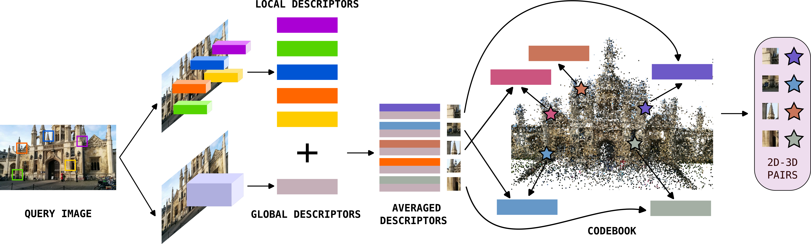
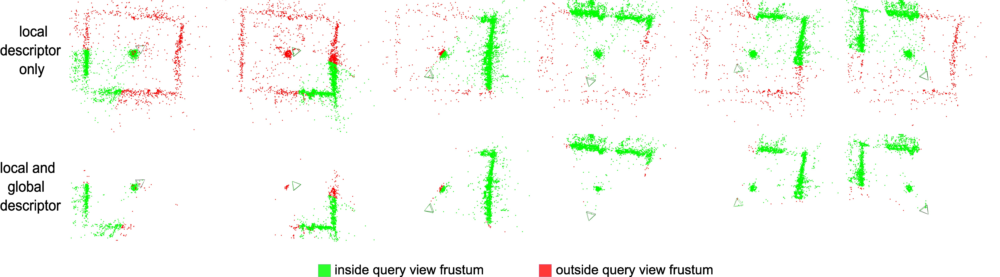

# FUSELOC: Fusing Global and Local Descriptors to Disambiguate 2D-3D Matching in Visual Localization

[[Arxiv]](https://arxiv.org/abs/2408.12037)

Here is the code for our paper on a simple way to disambiguate local descriptors in 2D-3D matching using global descriptors.

## Installation

We provided a list of requirements in this repo as a reference. Proceed at your own risk. Here are the installation instructions:

pixi add pycolmap h5py pykdtree poselib scikit-learn pytorch-lightning pytorch-metric-learning prettytable hloc

```bash
mamba install -c pytorch -c nvidia faiss-gpu=1.8.0 pytorch=1.12.1 cudatoolkit=11.2 pytorch-cuda=11 numpy
mamba install pycolmap h5py pykdtree poselib hloc scikit-learn
mamba install pytorch-lightning pytorch-metric-learning prettytable
```
For the global descriptors, we provide the code re-written from the authors of SALAD, MixVPR, and CRICA. Download them from [here](https://drive.google.com/file/d/1AKbCzmEbWDne1Pr2ExtsOuDE1oZibhmR/view?usp=sharing) and unzip to the parent directory of this repo. An example:
```shell
work/descriptor-disambiguation # this repo
work/CricaVPR
work/salad
work/MixVPR
```

## Dataset
We used Aachen day/night v1.1, RobotCar Seasons v2, Extended CMU Seasons, and Cambridge Landmarks. Our repo contains io functions for these datasets, you just need to download them. To download, refer to this [link](https://github.com/cvg/Hierarchical-Localization/tree/master/hloc/pipelines).

## Usage

Assume the dataset is downloaded somewhere, here is an example of usage:
```bash
python main_robotcar.py --dataset /work/qvpr/data/raw/2020VisualLocalization/RobotCar-Seasons --local_desc "d2net" --local_desc_dim 512 --global_desc "salad" --global_desc_dim 8448 --use_global 1 --convert 1
```

## Results


We consistently obtained significant improvement over the local-only baselines on the https://www.visuallocalization.net/ benchmark. See our paper for more details.

## Citation
```
@misc{nguyen2024fuselocfusinggloballocal,
      title={FUSELOC: Fusing Global and Local Descriptors to Disambiguate 2D-3D Matching in Visual Localization}, 
      author={Son Tung Nguyen and Alejandro Fontan and Michael Milford and Tobias Fischer},
      year={2024},
      eprint={2408.12037},
      archivePrefix={arXiv},
      primaryClass={cs.CV},
      url={https://arxiv.org/abs/2408.12037}, 
}
```