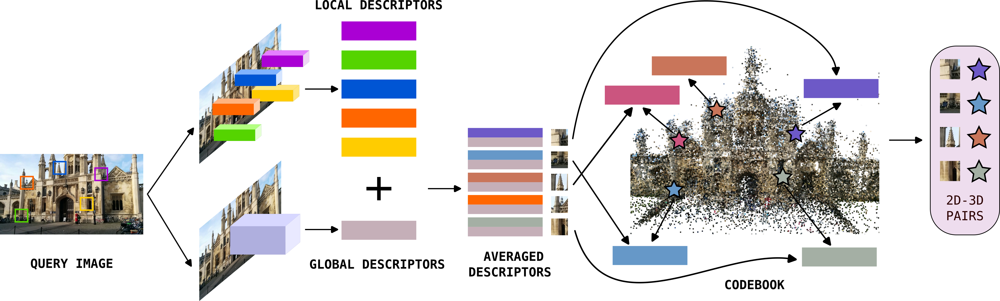
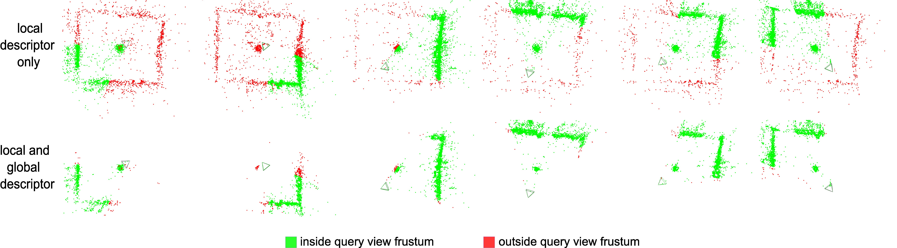

# FUSELOC: Fusing Global and Local Descriptors to Disambiguate 2D-3D Matching in Visual Localization

[[Paper]](https://openaccess.thecvf.com/content/ICCV2025W/CALIPOSE/papers/Nguyen_FUSELOC_Fusing_Global_and_Local_Descriptors_for_Fast_and_Robust_ICCVW_2025_paper.pdf)

Here is the code for our paper on a simple way to disambiguate local descriptors in 2D-3D matching using global descriptors.

## Installation

### If you are using [Pixi](https://pixi.sh/latest/installation/) (Recommended):
```shell
pixi install
pixi shell # activate the environment

# this is for hloc from pip
cd ..
git clone --recursive https://github.com/cvg/Hierarchical-Localization/
cd Hierarchical-Localization/
python -m pip install -e .

# this is for faiss
pip install https://github.com/kyamagu/faiss-wheels/releases/download/v1.7.3/faiss_gpu-1.7.3-cp310-cp310-manylinux_2_17_x86_64.manylinux2014_x86_64.whl
```

For the global descriptors, we provide the code re-written from the authors of SALAD, MixVPR, and CRICA. Download them from [here](https://drive.google.com/file/d/1AKbCzmEbWDne1Pr2ExtsOuDE1oZibhmR/view?usp=sharing) and unzip to the parent directory of this repo. An example:
```shell
work/descriptor-disambiguation # this repo
work/CricaVPR
work/salad
work/MixVPR
```

## Dataset
We used Aachen day/night v1.1, RobotCar Seasons v2, Extended CMU Seasons, and Cambridge Landmarks. Our repo contains io functions for these datasets, you just need to download them. To download, refer to this [link](https://github.com/cvg/Hierarchical-Localization/tree/master/hloc/pipelines).

## Usage

Assume the dataset is downloaded somewhere, here is an example of usage:
```bash
# default params are the strongest
pixi run python main_aachen.py --dataset datasets/aachen_v1.1
```
More can found at the ```scripts/``` folder.
## Results


We consistently obtained significant improvement over the local-only baselines on the https://www.visuallocalization.net/ benchmark. See our paper for more details.

## Citation
```
@inproceedings{nguyen2025fuseloc,
  title     = {FUSELOC: Fusing Global and Local Descriptors to Disambiguate 2D--3D Matching in Visual Localization},
  author    = {Nguyen, Son Tung and Fontan, Alejandro and Milford, Michael and Fischer, Tobias},
  booktitle = {Proceedings of the IEEE/CVF International Conference on Computer Vision Workshops (ICCVW)},
  year      = {2025}
}
```
